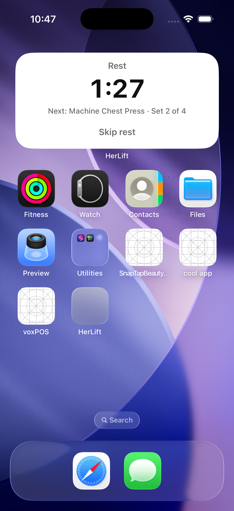
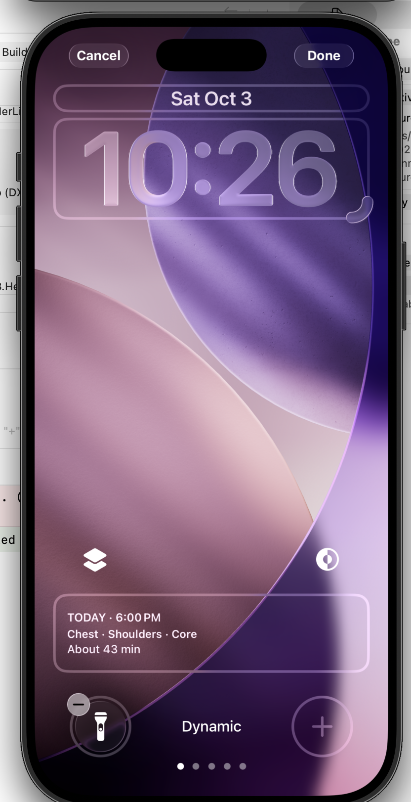
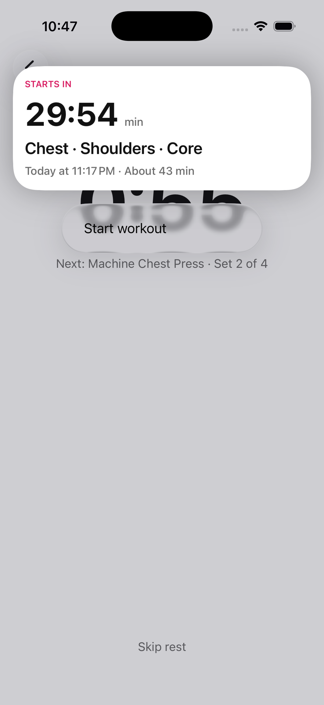
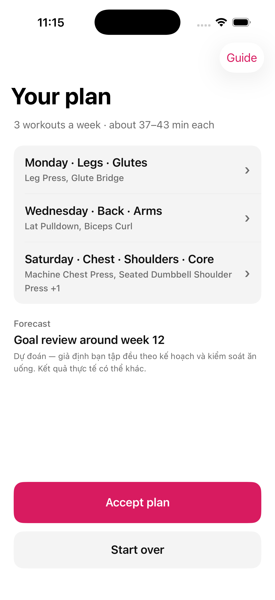
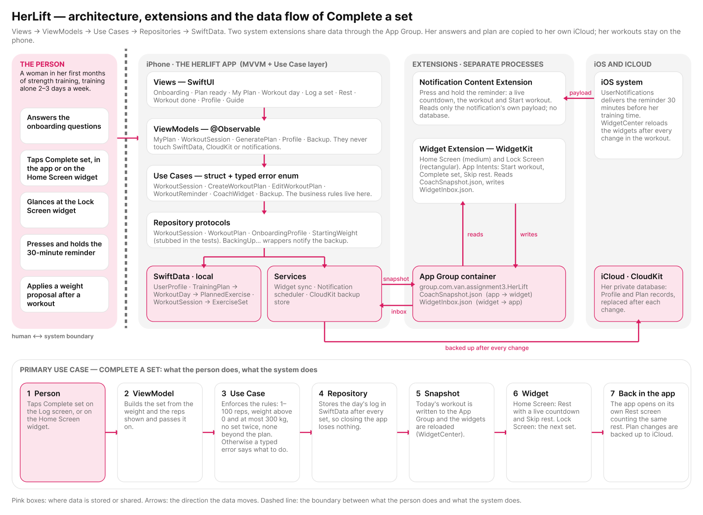
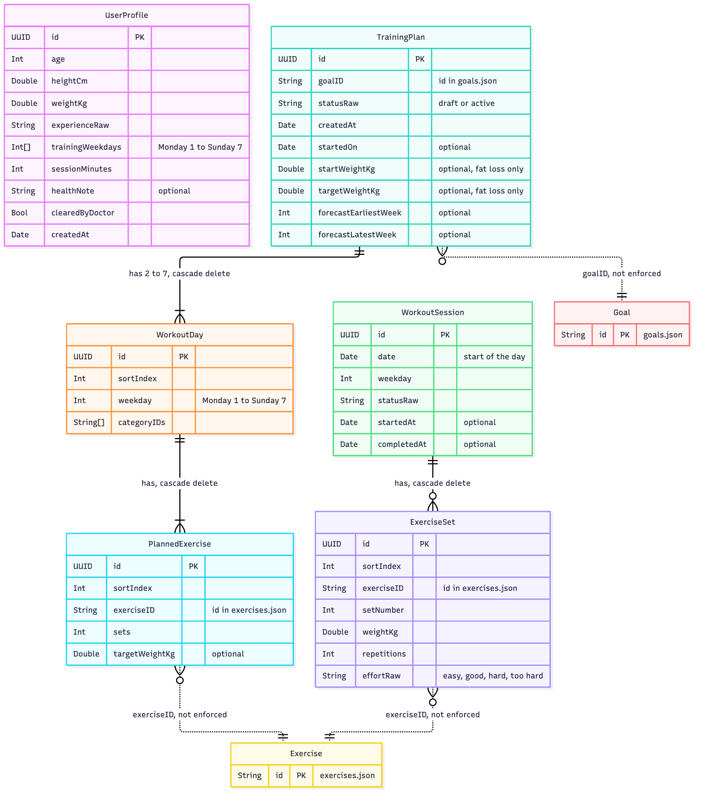

# HerLift

An iOS 26 strength-training guide for a woman in her first months of lifting. It builds her a private weekly plan from a bundled exercise catalogue, gives her a starting weight for every exercise, guides her through each workout from the Home Screen, the Lock Screen and the app, and proposes heavier or lighter weights for next time from how each set felt.

HerLift is a guide with feedback, **not a tracker**: it shows the weight and the reps she is asked to do, she taps **Complete set** and says how it felt. It does not ask her to type numbers.

Built for UTS iOS Application Development, **Assessment 3: a platform-integrated solution**. SwiftUI · SwiftData · WidgetKit · Notification Content Extension · CloudKit.

| | |
|---|---|
| App Group | `group.com.van.assignment3.HerLift` |
| iCloud container | `iCloud.com.van.assignment3.HerLift` |
| Bundle ids | `com.van.assignment3.HerLift` (app), `.HerLiftWidget` (widget), `.HerLiftReminderContent` (notification) |
| Platform | iOS 26.5, Xcode 26.5 |
| Tests | 254 unit tests in 16 files |

## Screenshots

Real screenshots from the iOS Simulator are in [`screenshot/`](screenshot/), one folder per feature; [`screenshot/README.md`](screenshot/README.md) says what each picture shows.

| Home Screen widget | Lock Screen widget | Reminder, pressed and held | Onboarding |
|---|---|---|---|
|  |  |  |  |

## Domain context

**The stakeholder** is a woman in her first months of strength training, aged roughly 18 to 55, who trains alone two or three days a week at a gym or at home. She has no personal trainer.

**The problem** appears in each part of a workout. *Before* it, she does not know what to do or what weight to start with. *During* it, her phone is locked in her hand and she loses track of her set and her rest. *After* it, nobody tells her whether the weight was right.

**The evidence:** research behind Sport England's *This Girl Can* campaign found that about two million fewer women than men took part in sport, that over 75% of women aged 14–40 wanted to exercise more, and that the main barrier was fear of judgement ([source](https://en.wikipedia.org/wiki/This_Girl_Can)). The gap is not a lack of intent; beginning in front of other people feels risky. HerLift gives a beginner a private plan, a starting weight and feedback, so fewer moments feel watched or uncertain.

HerLift does not give medical advice. Its starting weights are app defaults.

## What the app does

1. **Onboarding.** She answers two pages of questions: age, height, weight, experience; training days, minutes per workout and an optional health note. A health concern needs a doctor's clearance before a plan is made. She then picks a goal (lose fat, build muscle, get stronger, feel confident in the gym).
2. **Plan.** A deterministic planner builds a week of workouts from the catalogue: a muscle-group session per training day, filled with sets to fit her minutes. Every exercise with a load gets a **starting weight** from a table by experience, age, BMI and health. She sees a forecast and a plan to **Accept plan** or **Start over**.
3. **My Plan.** The week at a glance, with today's workout and Start.
4. **Workout.** *Log a set* shows the exercise, its video, the weight and reps to do and "How did it feel?" (Easy, Good, Hard, Too hard). *Rest* counts down and may suggest a lighter or heavier weight for the next set. *Workout done* summarises the workout and proposes new weights for next time (**Apply** or **Keep**); the plan only changes for the ones she applies.
5. **Beyond the app.** A widget on the Home Screen and Lock Screen, and a reminder 30 minutes before her training time (see below).
6. **Profile.** Her answers, her training time, a rebuild of the plan, and her iCloud backup.

## Architecture

```
Views (SwiftUI)  →  ViewModels (@Observable)  →  Use Cases (struct + typed error)  →  Repository protocols  →  SwiftData
```

No layer is skipped. `Views`, `ViewModels` and `UseCases` import none of `SwiftData`, `CloudKit`, `WidgetKit` or `UserNotifications`; those live in the repositories (`Repositories/`) and the services (`Services/`). Every repository is a protocol, so the tests replace it with a stub.

| Layer | Folder | Examples |
|---|---|---|
| Views | `HerLift/Views/` | `MyPlanView`, `LogSetView`, `RestView`, `WorkoutDoneView`, `ProfileView`, onboarding pages |
| ViewModels | `HerLift/ViewModels/` | `MyPlanViewModel`, `WorkoutSessionViewModel`, `BackupViewModel` |
| Use Cases | `HerLift/UseCases/` | `CreateWorkoutPlanUseCase`, `WorkoutSessionUseCase`, `BackupUseCase` |
| Domain models | `HerLift/Models/` | `WorkoutPlan`, `PlannedWorkout`, `WorkoutLog`, `PerceivedEffort`, `WeightProposal` |
| Repositories | `HerLift/Repositories/` | `WorkoutPlanRepository`, `WorkoutSessionRepository`, `OnboardingProfileRepository` |
| Services | `HerLift/Services/` | `AppGroupCoachWidgetSync`, `UserNotificationsReminderScheduler`, `CloudKitBackupStore` |
| Shared with extensions | `HerLift/Shared/` | `CoachSnapshot`, `CoachFiles`, `ReminderContent`, `WorkoutLink` |

### Use cases and their rules

Each use case is a struct named for a business operation, enforces rules, and throws a typed error whose message says what went wrong and what to do next.

| Use case | Business rules | Error |
|---|---|---|
| `CreateWorkoutPlanUseCase` | 2–7 distinct training days; 20–120 minutes; a health concern needs a doctor's clearance; the plan is validated before it is saved; every loaded exercise gets its starting weight | `PlanningError` |
| `EditWorkoutPlanUseCase` | one current plan; edits are validated; Accepting makes a draft active; target weights change only through Apply or a first workout | `WorkoutPlanError` |
| `WorkoutSessionUseCase` | only today's workout can start; 1–100 reps; weight above 0 and at most 300 kg (bodyweight records 0); no set twice; none beyond the plan; finishing needs at least one set | `WorkoutSessionError` |
| `BackupUseCase` | backs up the saved answers and the current plan; nothing to back up without answers | `BackupError` |
| `WorkoutReminderUseCase` | a reminder 30 minutes before her training time on the next training day, none for a finished workout | — |
| `CoachWidgetUseCase` | publishes today's workout to the widget; takes back what she did on it | — |
| `LoadOnboardingProfileUseCase`, `SaveOnboardingProfileUseCase`, `BrowseExerciseGuideUseCase` | validated answers; exercise lookup | typed errors |

Pure domain rules are plain functions with their own tests: the weight proposals after a workout (all planned sets at the top reps and easy or good → one step heavier; two or more sets too hard or short of the lowest reps → one step lighter; steps of 2.5 kg on machines and cables, 1 kg on dumbbells), the next-set suggestion, the starting-weight table, the forecast and milestones, the week layout and the widget's screens.

### Data flow of the primary use case: Complete a set

1. She taps **Complete set** (in the app, or on the Home Screen widget).
2. `WorkoutSessionViewModel` builds the set from the weight and reps shown.
3. `WorkoutSessionUseCase.record` enforces the rules above, or throws a `WorkoutSessionError`.
4. `WorkoutSessionRepository.save` stores the day's log in SwiftData after every set, so closing the app loses nothing.
5. The view model tells `MyPlanViewModel`, which has `CoachSnapshotBuilder` write `CoachSnapshot.json` into the App Group and `WidgetCenter` reload the widgets.
6. The widget shows the rest as a live countdown; the Lock Screen shows the next set.
7. When the app is opened, it shows its own Rest screen, counting the same rest.

## System extensions

Two extensions, each built around a moment in her workout.

### Widget Extension (WidgetKit) — Home Screen and Lock Screen

*The scenario:* between sets, with her phone locked or in one hand. The Lock Screen widget (`accessoryRectangular`) shows "Set 2 of 3 · Machine Chest Press · 20 kg × 12 reps" or the rest countdown. The Home Screen widget (`systemMedium`) has **Start workout**, **Complete set** and **Skip rest** buttons (App Intents) and shows the week before the workout, so she logs a set without unlocking the phone and opening the app. One widget has two families because the moments differ: a glance, and a tap.

The widget reads `CoachSnapshot.json` from the App Group and writes `WidgetInbox.json` (the start, the sets she finished, the rest). The app calls `WidgetCenter.reloadAllTimelines()` after every change in the workout, and takes the widget's changes back when it becomes active.

### Notification Content Extension (`HerLiftReminderContent`)

*The scenario:* the moment before. Thirty minutes before her training time the reminder is the only part of the app that reaches her without her asking. Pressing and holding it shows a live countdown ("STARTS IN 29:42 min"), what she trains and for how long, and **Start workout**, which opens the app on today's workout, or on its log if it was already started. The widget cannot do this job: it is passive, she has to look at it. The view reads only the notification's own payload, so it needs no database.

### App Group

`group.com.van.assignment3.HerLift` holds two small files and no database:

| File | Written by | Read by |
|---|---|---|
| `CoachSnapshot.json` | the app: today's workout, the week, the sets still to do, the rest | the widget |
| `WidgetInbox.json` | the widget: the start, the sets she finished, the rest | the app |

Changes to the inbox are made under a file coordinator so the app and the widget never overwrite each other. The trade-off: a widget cannot wake its app, so the app learns about a widget tap when it next opens.

## Database

**SwiftData** (built on Core Data's storage) holds the data she works with, because a set must be saved immediately and offline, and the data is relational. Six entities:

```
UserProfile
TrainingPlan → WorkoutDay → PlannedExercise      (target weight is an optional field)
WorkoutSession → ExerciseSet
```

Queries reflect domain conditions, for example "the days on which a workout was completed" and "today's workout". All access goes through repository protocols (`WorkoutPlanRepository`, `WorkoutSessionRepository`, `OnboardingProfileRepository`). The most significant schema decision is the optional target weight on each planned exercise: starting weights, the calibration after a first workout and the proposals she applies all write that one field, so the plan, the Log screen, the widget and the backup always agree.

**CloudKit** keeps a private backup of her saved answers and her current plan: one `Profile` record and one `Plan` record (the plan as plain JSON by exercise id) in the private database of her own iCloud account, written a couple of seconds after every change, and by **Back up now** in Profile. Her identity is the iCloud account on the phone, so there is no sign-in screen, and only she can read the data. Her workouts stay on the phone. There is no restore yet.

## Design

The diagrams the app was built from, as pictures in [`design/`](design/):

| Diagram | File |
|---|---|
| One-page architecture: layers, extensions, App Group, iCloud and the data flow of Complete a set | [`design/architecture.png`](design/architecture.png) |
| Entity-relationship diagram of the six SwiftData entities, as built | [`design/erd.png`](design/erd.png) |





In the ERD, solid lines are SwiftData relationships (deleting a parent deletes its children). Dotted lines are plain string ids into the bundled JSON catalogue (`Goal`, `Exercise`); the store does not enforce them. One plan is stored at a time, a day holds at most one workout, and a workout is not linked to the plan except by a copy of the weekday, so rebuilding the plan keeps the workouts already done.

## Setup

**Requirements:** Xcode 26.5, the iOS 26.5 SDK and an iOS 26.5 simulator (iPhone 17 Pro was used).

1. Open `HerLift.xcodeproj` and choose the **HerLift** scheme and an iPhone simulator.
2. Press **⌘R**. The first launch shows onboarding. No account or network is needed.
3. Run the tests with **⌘U**, or:
   ```
   xcodebuild test -project HerLift.xcodeproj -scheme HerLift \
     -destination 'platform=iOS Simulator,name=iPhone 17 Pro'
   ```

**Trying the extensions on the simulator**

- **Home Screen widget:** press and hold the Home Screen → **Edit** → **Add Widget** → **HerLift** → **Workout** → **Add Widget**. Accept a plan, tap **Start** on today's workout and the widget follows; tap **Complete set** on the widget.
- **Lock Screen widget:** lock the device (⌘L), press and hold the Lock Screen → **Customize** → **Lock Screen** → add **Workout** under the clock.
- **Reminder:** open **Profile** → **Send test reminder**, allow notifications, wait five seconds, then press and hold the banner (or swipe it left and tap **View**). The real reminder is scheduled for 30 minutes before the training time chosen in **Profile → Training time**.
- **iCloud backup:** sign in to iCloud in the simulator's Settings, then use **Profile → Back up now**. Without an account, or when the app is not set up for the container, the button shows what is wrong and the rest of the app is unaffected.

**Running with your own signing team.** The identifiers above belong to the author's team. To run on a device, change the **Team** and the three bundle identifiers (app, widget, notification extension), create your own App Group and iCloud container, and update `appGroupID` in `HerLift/Shared/CoachFiles.swift`. The simulator does not need signing.

## Testing

254 unit tests (Swift Testing) in `HerLiftTests/`. Use cases and view models are tested against stub repositories, not the real stores; the SwiftData repositories are tested separately against an in-memory container. Test names describe a scenario in domain terms, for example `aWorkoutStartedOnTheWidgetOpensOnItsLogInTheApp`, `newTargetWeightsFromFeedbackReachTheCloudToo` and `aHealthConcernClearedByADoctorStartsLighterRoundedDown`. They cover happy paths, boundaries (reps 1–100, weight up to 300 kg, 2–7 training days) and domain errors.

## Git workflow

`main` holds stable code. Work happens on `feature/…`, `fix/…`, `test/…` and `docs/…` branches, merged by pull request, with [Conventional Commits](https://www.conventionalcommits.org) (`feat:`, `fix:`, `docs:`, `test:`). Some early commits do not follow the convention and history was not rewritten.

## Project structure

```
HerLift/                       the app
  Models/ Repositories/ UseCases/ ViewModels/ Views/ Services/ Shared/ Resources/
HerLiftWidget/                 the Widget Extension (Home Screen and Lock Screen)
HerLiftReminderContent/        the Notification Content Extension
HerLiftTests/                  unit tests
design/                        architecture diagram and ERD (PNG)
screenshot/                    screenshots of each feature, with an index
```

`Resources/` holds the exercise catalogue (`exercises.json`), its photos and demonstration videos, the training patterns, the goals and the starting-weight table (`starting_weights.json`).

## Known limits

- The starting weights and the planner's rules are app defaults written in a coach role, not medical advice, and should be reviewed by a real coach before anyone else uses the app.
- The backup has no restore, no sync between devices, and does not include her training time or her workouts.
- Widget taps reach the app when it next opens.
- Not built: a Share or Action extension, a numeric rep tracker (by design), and a backend with AI suggestions.

## AI tools

I used **Claude Code** (Anthropic) throughout, under my direction, to design, write and test the code, and a **Figma bridge** to build the screen and widget designs before the code. I worked in small parts, reviewed each group of changes before committing it, and ran the tests on exactly the files I had staged. The planner's rules and the starting-weight table were written with the assistant; the table was written in a "coach" role and is labelled as app defaults. The assignment's Required Document describes what worked and what did not.

## Attributions

- Apple developer documentation and sample patterns for WidgetKit, App Intents, UserNotifications and UserNotificationsUI, SwiftData and CloudKit: https://developer.apple.com/documentation
- Exercise text from **free-exercise-db-api** (MIT), see below.
- Sport England, *This Girl Can* (research summarised at https://en.wikipedia.org/wiki/This_Girl_Can).
- No third-party Swift packages are used.

## Copyright and third-party content

### HerLift code
The HerLift source code was written for a UTS iOS Application Development assignment (2026).

### Exercise text — MIT License
`HerLift/Resources/exercises.json` contains 20 exercises. These fields are taken or adapted from **free-exercise-db-api** (https://github.com/luisaraujoc/free-exercise-db-api), read on 1 October 2026:
`shortDescription`, `instructions`, `coachingCues`, `commonMistakes`, `breathing` and `secondaryMuscles`.

All other fields belong to HerLift: `id`, `name`, `muscleGroup`, `primaryMuscle`, `equipment`, `level`, `loadType`, `position`, `impact`, rep ranges, rest times and alternatives. The `source` block in each entry names the original exercise it came from.

The licence of free-exercise-db-api covers only its **code and exercise metadata**:

```
MIT License

Copyright (c) 2026 Arham Wani

Permission is hereby granted, free of charge, to any person obtaining a copy
of this software and associated documentation files (the "Software"), to deal
in the Software without restriction, including without limitation the rights
to use, copy, modify, merge, publish, distribute, sublicense, and/or sell
copies of the Software, and to permit persons to whom the Software is
furnished to do so, subject to the following conditions:

The above copyright notice and this permission notice shall be included in all
copies or substantial portions of the Software.

THE SOFTWARE IS PROVIDED "AS IS", WITHOUT WARRANTY OF ANY KIND, EXPRESS OR
IMPLIED, INCLUDING BUT NOT LIMITED TO THE WARRANTIES OF MERCHANTABILITY,
FITNESS FOR A PARTICULAR PURPOSE AND NONINFRINGEMENT. IN NO EVENT SHALL THE
AUTHORS OR COPYRIGHT HOLDERS BE LIABLE FOR ANY CLAIM, DAMAGES OR OTHER
LIABILITY, WHETHER IN AN ACTION OF CONTRACT, TORT OR OTHERWISE, ARISING FROM,
OUT OF OR IN CONNECTION WITH THE SOFTWARE OR THE USE OR OTHER DEALINGS IN THE
SOFTWARE.
```

### Exercise demo videos — copyright owner unknown
The 20 files in `HerLift/Resources/Videos/` are the female demo videos distributed with free-exercise-db-api.

**The MIT License above does not cover them, and HerLift does not own their copyright.** The dataset's README says its author bought the videos from a seller found through an Instagram ad, and does not know where that seller got them. The author's advice is "use with caution".

Because of this:
- the videos are used here only for a non-commercial university assignment and are not offered under any licence;
- HerLift claims no rights in them;
- if you are the copyright owner and want them removed or credited, please open an issue and they will be removed.

Before HerLift is published on the App Store or made public outside the assignment, replace these videos with media whose licence is known.
